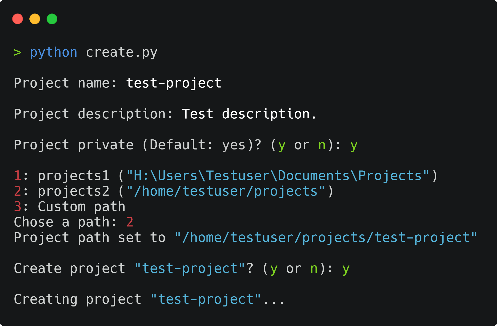

# Project Automation

A script that automates my GitHub project creation routine using PyGithub.

<p align="center"></p>

## What it does
- Creates a private or public GitHub repository with project name and description
- Creates the project in the specified directory
- Adds a ```README.md``` with the project name and description to the project
- Adds an empty ```.gitignore``` to the project
- Commits ```README.md``` and ```.gitignore```
- Opens the project in Visual Studio Code

## Installation

### Clone 
Clone this repo to your local machine using 
```
git clone https://github.com/luka1199/project-automation
```

### Dependencies
Run ```pip install -r requirenments.txt``` to install the dependencies. 

<!-- ### Permissions
Make the ```create_repo.sh``` file executable:
```
chmod +x create_repo.sh
``` -->

### Setup
The ```config.yaml``` will be created after running ```python create.py``` for the first time.  
Alternatively you can run ```cp config_default.yaml config.yaml``` to create the config manually.

You can use the ```config.yaml``` to save your GitHub credentials and multiple project locations.

Format of the config:
```yaml
credentials:
  username: ''
  password: ''
  access_token: ''

paths:
  path1: ''
  path2: ''
  path3: ''
```
You can change the names of the paths and add as many as you like.

## How to run the script

```
python create.py
```

